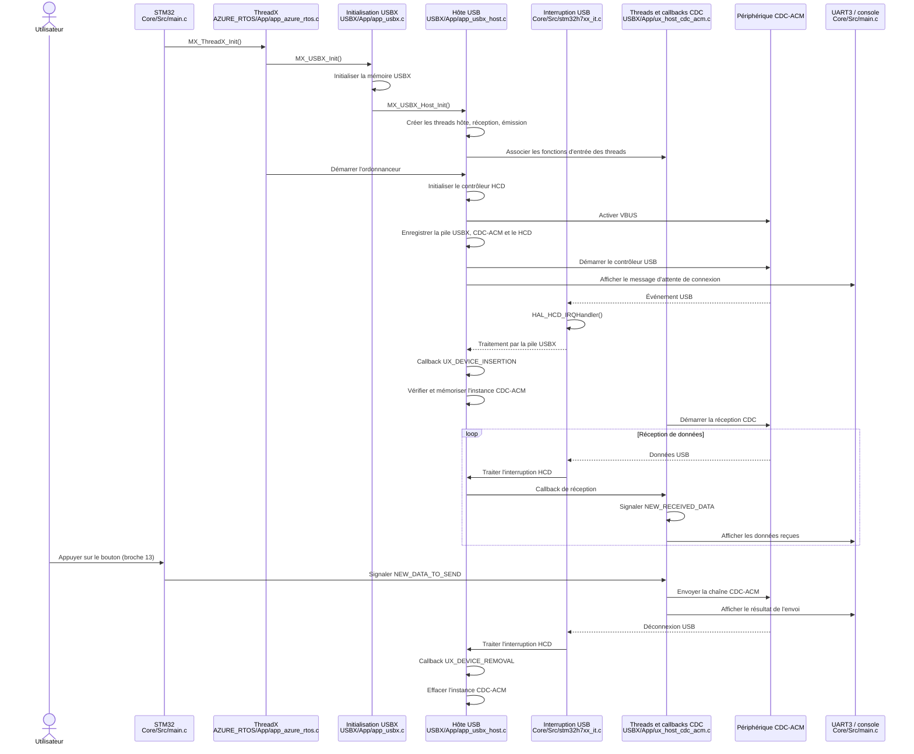

```mermaid
sequenceDiagram
    actor User as Utilisateur
    participant Main as STM32<br/>Core/Src/main.c
    participant ThreadX as ThreadX<br/>AZURE_RTOS/App/app_azure_rtos.c
    participant USBXInit as Initialisation USBX<br/>USBX/App/app_usbx.c
    participant Host as Hôte USB<br/>USBX/App/app_usbx_host.c
    participant ISR as Interruption USB<br/>Core/Src/stm32h7xx_it.c
    participant CDC as Threads et callbacks CDC<br/>USBX/App/ux_host_cdc_acm.c
    participant Device as Périphérique CDC-ACM
    participant UART as UART3 / console<br/>Core/Src/main.c

    Main->>ThreadX: MX_ThreadX_Init()
    ThreadX->>USBXInit: MX_USBX_Init()
    USBXInit->>USBXInit: Initialiser la mémoire USBX
    USBXInit->>Host: MX_USBX_Host_Init()
    Host->>Host: Créer les threads hôte, réception, émission
    Host->>CDC: Associer les fonctions d'entrée des threads

    ThreadX->>Host: Démarrer l'ordonnanceur
    Host->>Host: Initialiser le contrôleur HCD
    Host->>Device: Activer VBUS
    Host->>Host: Enregistrer la pile USBX, CDC-ACM et le HCD
    Host->>Device: Démarrer le contrôleur USB
    Host->>UART: Afficher le message d'attente de connexion

    Device-->>ISR: Événement USB
    ISR->>ISR: HAL_HCD_IRQHandler()
    ISR-->>Host: Traitement par la pile USBX
    Host->>Host: Callback UX_DEVICE_INSERTION
    Host->>Host: Vérifier et mémoriser l'instance CDC-ACM

    CDC->>Device: Démarrer la réception CDC
    loop Réception de données
        Device-->>ISR: Données USB
        ISR->>Host: Traiter l'interruption HCD
        Host->>CDC: Callback de réception
        CDC->>CDC: Signaler NEW_RECEIVED_DATA
        CDC->>UART: Afficher les données reçues
    end

    User->>Main: Appuyer sur le bouton (broche 13)
    Main->>CDC: Signaler NEW_DATA_TO_SEND
    CDC->>Device: Envoyer la chaîne CDC-ACM
    CDC->>UART: Afficher le résultat de l'envoi

    Device-->>ISR: Déconnexion USB
    ISR->>Host: Traiter l'interruption HCD
    Host->>Host: Callback UX_DEVICE_REMOVAL
    Host->>Host: Effacer l'instance CDC-ACM
```