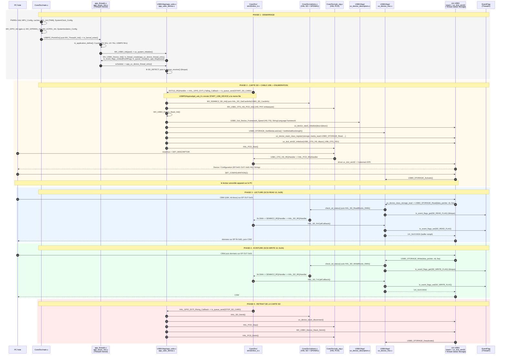

```mermaid
sequenceDiagram
    autonumber
    participant PC as PC hote
    participant MAIN as Core/Src/main.c
    participant RT as app_threadx.c<br/>app_azure_rtos.c<br/>(ThreadX kernel)
    participant DEV as USBX/App/app_usbx.c<br/>app_usbx_device.c
    participant IT as Core/Src/<br/>stm32n6xx_it.c
    participant SD as Core/Src/sdmmc.c<br/>(HAL SD + GPDMA1)
    participant OTG as Core/Src/usb_otg.c<br/>(HAL PCD)
    participant DESC as USBX/App/<br/>ux_device_descriptors.c
    participant MSC as USBX/App/<br/>ux_device_msc.c
    participant UX as Lib USBX<br/>(stack + ux_dcd_stm32<br/>+ thread classe Storage)
    participant EF as EventFlag<br/>(ThreadX)

    rect rgb(245,245,245)
    Note over MAIN,EF: PHASE 1 - DEMARRAGE
    MAIN->>MAIN: PWREx Vdd, MPU_Config, caches, HAL_Init (TIM6), SystemClock_Config
    MAIN->>MAIN: MX_GPIO_Init (gpio.c), MX_GPDMA1_Init, MX_UCPD1_Init, SystemIsolation_Config
    MAIN->>RT: USBPD_PreInitOs() puis MX_ThreadX_Init() -> tx_kernel_enter()
    RT->>RT: tx_application_define(): 3 pools (TX 1Ko, UX 7Ko, USBPD 5Ko)
    RT->>DEV: MX_USBX_Init(pool) -> ux_system_initialize()
    DEV->>RT: MX_USBX_Device_Init(): tx_thread_create(app_ux_device_thread_entry),<br/>tx_event_flags_create(EventFlag), tx_queue_create(ux_app_MsgQueue)
    RT->>DEV: scheduler -> app_ux_device_thread_entry()
    DEV->>DEV: lit SD_DETECT, puis tx_queue_receive() (bloque)
    end

    rect rgb(255,250,235)
    Note over MAIN,EF: PHASE 2 - CARTE SD + CABLE USB -> ENUMERATION
    IT->>DEV: EXTI12_IRQHandler -> HAL_GPIO_EXTI_Falling_Callback -> tx_queue_send(START_SD_CARD)
    Note over IT,DEV: USBPD/App/usbpd_usb_if.c envoie START_USB_DEVICE a la meme file
    DEV->>SD: MX_SDMMC2_SD_Init() puis HAL_SD_GetCardInfo(USBD_SD_CardInfo)
    DEV->>OTG: MX_USB1_OTG_HS_PCD_Init() (HS, PHY embarquee)
    DEV->>DEV: MX_USBX_Device_Stack_Init()
    DEV->>DESC: USBD_Get_Device_Framework_Speed (HS, FS), String/Language framework
    DEV->>UX: ux_device_stack_initialize(descripteurs)
    DEV->>MSC: USBD_STORAGE_GetMediaLastLba() / GetMediaBlocklength()
    DEV->>UX: ux_device_stack_class_register(storage, media_read=USBD_STORAGE_Read, ...)
    DEV->>UX: ux_dcd_stm32_initialize(USB1_OTG_HS, &hpcd_USB_OTG_HS1)
    DEV->>OTG: HAL_PCD_Start()
    PC->>OTG: reset bus + GET_DESCRIPTOR
    OTG->>IT: USB1_OTG_HS_IRQHandler -> HAL_PCD_IRQHandler
    IT->>UX: driver ux_dcd_stm32 -> traitement EP0
    UX-->>PC: Device / Configuration (EP 0x01 OUT, 0x81 IN) / Strings
    PC->>UX: SET_CONFIGURATION(1)
    UX->>MSC: USBD_STORAGE_Activate()
    Note over PC,UX: le lecteur amovible apparait sur le PC
    end

    rect rgb(235,245,255)
    Note over MAIN,EF: PHASE 3 - LECTURE (SCSI READ 10, 0x28)
    PC->>UX: CBW (LBA, nb blocs) sur EP OUT 0x01
    UX->>MSC: ux_device_class_storage_read -> USBD_STORAGE_Read(data_pointer, nb, lba)
    MSC->>SD: check_sd_status() puis HAL_SD_ReadBlocks_DMA()
    MSC->>EF: tx_event_flags_get(SD_READ_FLAG) (bloque)
    SD-->>IT: fin DMA -> SDMMC2_IRQHandler -> HAL_SD_IRQHandler
    IT->>MSC: HAL_SD_RxCpltCallback()
    MSC->>EF: tx_event_flags_set(SD_READ_FLAG)
    MSC-->>UX: UX_SUCCESS (buffer rempli)
    UX-->>PC: donnees sur EP IN 0x81, puis CSW
    end

    rect rgb(235,255,240)
    Note over MAIN,EF: PHASE 4 - ECRITURE (SCSI WRITE 10, 0x2A)
    PC->>UX: CBW puis donnees sur EP OUT 0x01
    UX->>MSC: USBD_STORAGE_Write(data_pointer, nb, lba)
    MSC->>SD: check_sd_status() puis HAL_SD_WriteBlocks_DMA()
    MSC->>EF: tx_event_flags_get(SD_WRITE_FLAG) (bloque)
    SD-->>IT: fin DMA -> SDMMC2_IRQHandler -> HAL_SD_IRQHandler
    IT->>MSC: HAL_SD_TxCpltCallback()
    MSC->>EF: tx_event_flags_set(SD_WRITE_FLAG)
    MSC-->>UX: UX_SUCCESS
    UX-->>PC: CSW
    end

    rect rgb(255,235,235)
    Note over MAIN,EF: PHASE 5 - RETRAIT DE LA CARTE SD
    IT->>DEV: HAL_GPIO_EXTI_Rising_Callback -> tx_queue_send(STOP_SD_CARD)
    DEV->>SD: HAL_SD_DeInit()
    DEV->>UX: ux_device_stack_disconnect()
    DEV->>OTG: HAL_PCD_Stop()
    DEV->>UX: MX_USBX_Device_Stack_DeInit()
    DEV->>OTG: HAL_PCD_DeInit()
    UX->>MSC: USBD_STORAGE_Deactivate()
    end
```