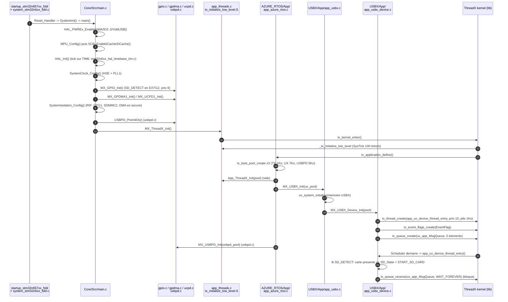

```mermaid
sequenceDiagram
    autonumber
    participant ST as startup_stm32n657xx_fsbl<br/>+ system_stm32n6xx_fsbl.c
    participant M as Core/Src/main.c
    participant P as gpio.c / gpdma.c / ucpd.c<br/>usbpd.c
    participant TX as app_threadx.c<br/>tx_initialize_low_level.S
    participant RT as AZURE_RTOS/App/<br/>app_azure_rtos.c
    participant UX as USBX/App/app_usbx.c
    participant DEV as USBX/App/<br/>app_usbx_device.c
    participant K as ThreadX kernel (lib)

    ST->>M: Reset_Handler -> SystemInit() -> main()
    M->>M: HAL_PWREx_EnableVddA/IO2..5/VddUSB()
    M->>M: MPU_Config() puis SCB_EnableICache/DCache()
    M->>M: HAL_Init() (tick sur TIM6: stm32n6xx_hal_timebase_tim.c)
    M->>M: SystemClock_Config() (HSE + PLL1)
    M->>P: MX_GPIO_Init() (SD_DETECT en EXTI12, prio 6)
    M->>P: MX_GPDMA1_Init() / MX_UCPD1_Init()
    M->>M: SystemIsolation_Config() (RIF: OTG1, SDMMC2, DMA en secure)
    M->>P: USBPD_PreInitOs() (usbpd.c)
    M->>TX: MX_ThreadX_Init()
    TX->>K: tx_kernel_enter()
    K->>TX: _tx_initialize_low_level (SysTick 100 ticks/s)
    K->>RT: tx_application_define()
    RT->>RT: tx_byte_pool_create x3 (TX 1Ko, UX 7Ko, USBPD 5Ko)
    RT->>TX: App_ThreadX_Init(pool) (vide)
    RT->>UX: MX_USBX_Init(ux_pool)
    UX->>UX: ux_system_initialize(memoire USBX)
    UX->>DEV: MX_USBX_Device_Init(pool)
    DEV->>K: tx_thread_create(app_ux_device_thread_entry, prio 10, pile 1Ko)
    DEV->>K: tx_event_flags_create(EventFlag)
    DEV->>K: tx_queue_create(ux_app_MsgQueue, 5 elements)
    RT->>P: MX_USBPD_Init(usbpd_pool) (usbpd.c)
    K->>DEV: Scheduler demarre -> app_ux_device_thread_entry()
    DEV->>DEV: lit SD_DETECT: carte presente => SD_State = START_SD_CARD
    DEV->>K: tx_queue_receive(ux_app_MsgQueue, WAIT_FOREVER) (bloque)
```