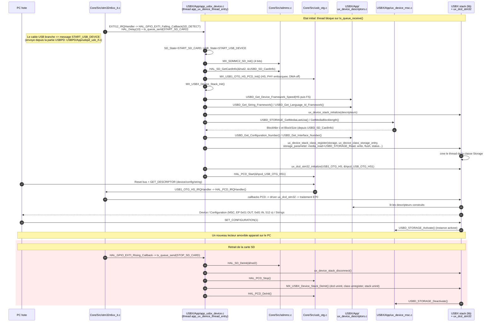

```mermaid
sequenceDiagram
    autonumber
    participant PC as PC hote
    participant IT as Core/Src/stm32n6xx_it.c
    participant DEV as USBX/App/app_usbx_device.c<br/>(thread app_ux_device_thread_entry)
    participant SD as Core/Src/sdmmc.c
    participant OTG as Core/Src/usb_otg.c
    participant DESC as USBX/App/<br/>ux_device_descriptors.c
    participant MSC as USBX/App/ux_device_msc.c
    participant USBX as USBX stack (lib)<br/>+ ux_dcd_stm32

    Note over DEV,USBX: Etat initial: thread bloque sur tx_queue_receive()
    IT->>DEV: EXTI12_IRQHandler -> HAL_GPIO_EXTI_Falling_Callback(SD_DETECT)<br/>HAL_Delay(10) + tx_queue_send(START_SD_CARD)
    Note right of PC: Le cable USB branche => message START_USB_DEVICE<br/>(envoye depuis la partie USBPD: USBPD/App/usbpd_usb_if.c)
    DEV->>DEV: SD_State=START_SD_CARD, USB_State=START_USB_DEVICE
    DEV->>SD: MX_SDMMC2_SD_Init() (4 bits)
    DEV->>SD: HAL_SD_GetCardInfo(&hsd2, &USBD_SD_CardInfo)
    DEV->>OTG: MX_USB1_OTG_HS_PCD_Init() (HS, PHY embarquee, DMA off)
    DEV->>DEV: MX_USBX_Device_Stack_Init()
    DEV->>DESC: USBD_Get_Device_Framework_Speed(HS puis FS)
    DEV->>DESC: USBD_Get_String_Framework() / USBD_Get_Language_Id_Framework()
    DEV->>USBX: ux_device_stack_initialize(descripteurs)
    DEV->>MSC: USBD_STORAGE_GetMediaLastLba() / GetMediaBlocklength()
    MSC-->>DEV: BlockNbr-1 et BlockSize (depuis USBD_SD_CardInfo)
    DEV->>DESC: USBD_Get_Configuration_Number() / USBD_Get_Interface_Number()
    DEV->>USBX: ux_device_stack_class_register(storage, ux_device_class_storage_entry,<br/>storage_parameter: media_read=USBD_STORAGE_Read, write, flush, status...)
    USBX->>USBX: cree le thread de la classe Storage
    DEV->>USBX: ux_dcd_stm32_initialize(USB1_OTG_HS, &hpcd_USB_OTG_HS1)
    DEV->>OTG: HAL_PCD_Start(&hpcd_USB_OTG_HS1)
    PC->>OTG: Reset bus + GET_DESCRIPTOR (device/config/string)
    OTG->>IT: USB1_OTG_HS_IRQHandler -> HAL_PCD_IRQHandler()
    IT->>USBX: callbacks PCD -> driver ux_dcd_stm32 -> traitement EP0
    USBX->>DESC: lit les descripteurs construits
    USBX-->>PC: Device / Configuration (MSC, EP 0x01 OUT, 0x81 IN, 512 o) / Strings
    PC->>USBX: SET_CONFIGURATION(1)
    USBX->>MSC: USBD_STORAGE_Activate() (instance activee)
    Note over PC,USBX: Un nouveau lecteur amovible apparait sur le PC

    rect rgb(255,235,235)
    Note over PC,USBX: Retrait de la carte SD
    IT->>DEV: HAL_GPIO_EXTI_Rising_Callback -> tx_queue_send(STOP_SD_CARD)
    DEV->>SD: HAL_SD_DeInit(&hsd2)
    DEV->>USBX: ux_device_stack_disconnect()
    DEV->>OTG: HAL_PCD_Stop()
    DEV->>USBX: MX_USBX_Device_Stack_DeInit() (dcd uninit, class unregister, stack uninit)
    DEV->>OTG: HAL_PCD_DeInit()
    USBX->>MSC: USBD_STORAGE_Deactivate()
    end
```
