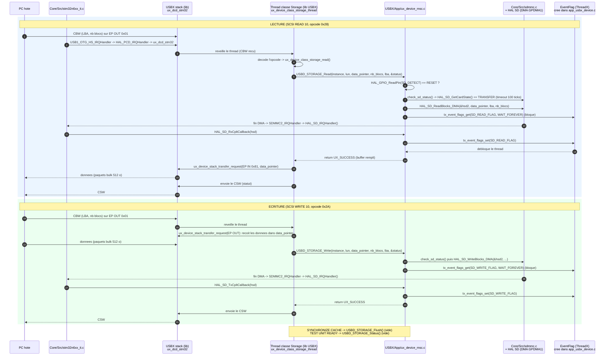

```mermaid
sequenceDiagram
    autonumber
    participant PC as PC hote
    participant IT as Core/Src/stm32n6xx_it.c
    participant USBX as USBX stack (lib)<br/>ux_dcd_stm32
    participant CT as Thread classe Storage (lib USBX)<br/>ux_device_class_storage_thread
    participant MSC as USBX/App/ux_device_msc.c
    participant SD as Core/Src/sdmmc.c<br/>+ HAL SD (DMA GPDMA1)
    participant EF as EventFlag (ThreadX)<br/>cree dans app_usbx_device.c

    rect rgb(235,245,255)
    Note over PC,EF: LECTURE (SCSI READ 10, opcode 0x28)
    PC->>USBX: CBW (LBA, nb blocs) sur EP OUT 0x01
    IT->>USBX: USB1_OTG_HS_IRQHandler -> HAL_PCD_IRQHandler -> ux_dcd_stm32
    USBX->>CT: reveille le thread (CBW recu)
    CT->>CT: decode l'opcode -> ux_device_class_storage_read()
    CT->>MSC: USBD_STORAGE_Read(instance, lun, data_pointer, nb_blocs, lba, &status)
    MSC->>MSC: HAL_GPIO_ReadPin(SD_DETECT) == RESET ?
    MSC->>SD: check_sd_status() -> HAL_SD_GetCardState() == TRANSFER (timeout 100 ticks)
    MSC->>SD: HAL_SD_ReadBlocks_DMA(&hsd2, data_pointer, lba, nb_blocs)
    MSC->>EF: tx_event_flags_get(SD_READ_FLAG, WAIT_FOREVER) (bloque)
    SD-->>IT: fin DMA -> SDMMC2_IRQHandler -> HAL_SD_IRQHandler()
    IT->>MSC: HAL_SD_RxCpltCallback(hsd)
    MSC->>EF: tx_event_flags_set(SD_READ_FLAG)
    EF-->>MSC: debloque le thread
    MSC-->>CT: return UX_SUCCESS (buffer rempli)
    CT->>USBX: ux_device_stack_transfer_request(EP IN 0x81, data_pointer)
    USBX-->>PC: donnees (paquets bulk 512 o)
    CT->>USBX: envoie le CSW (statut)
    USBX-->>PC: CSW
    end

    rect rgb(235,255,240)
    Note over PC,EF: ECRITURE (SCSI WRITE 10, opcode 0x2A)
    PC->>USBX: CBW (LBA, nb blocs) sur EP OUT 0x01
    USBX->>CT: reveille le thread
    CT->>USBX: ux_device_stack_transfer_request(EP OUT): recoit les donnees dans data_pointer
    PC->>USBX: donnees (paquets bulk 512 o)
    CT->>MSC: USBD_STORAGE_Write(instance, lun, data_pointer, nb_blocs, lba, &status)
    MSC->>SD: check_sd_status() puis HAL_SD_WriteBlocks_DMA(&hsd2, ...)
    MSC->>EF: tx_event_flags_get(SD_WRITE_FLAG, WAIT_FOREVER) (bloque)
    SD-->>IT: fin DMA -> SDMMC2_IRQHandler -> HAL_SD_IRQHandler()
    IT->>MSC: HAL_SD_TxCpltCallback(hsd)
    MSC->>EF: tx_event_flags_set(SD_WRITE_FLAG)
    MSC-->>CT: return UX_SUCCESS
    CT->>USBX: envoie le CSW
    USBX-->>PC: CSW
    end

    Note over CT,MSC: SYNCHRONIZE CACHE -> USBD_STORAGE_Flush() (vide)<br/>TEST UNIT READY -> USBD_STORAGE_Status() (vide)
```